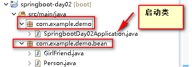
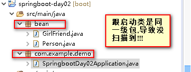

# day02-SpringBoot配置

# 一.配置文件


## 1、配置文件

SpringBoot使用的是一个全局配置文件,文件名是固定的

- application.properties
- application.yml


配置文件的作用：修改SpringBoot自动配置的默认值,SpringBoot在底层给我们自动配置好

例如：springBoot 默认的server.port=8080, 但我们可以通过配置文件将端口改为8081启动

**YAML:**

​	以前的配置文件；大多都是使用 **xxx.xml**文件;

​	YAML: **以数据为中心**，比json, xml等更适合做配置文件

yml：配置例子

```java
server:
  port: 8081
```

xml: 

```xml
<server>
	<port>8081</port>
</server>
```

properties:

```properties
server.port=8081
```


## 2.YAML语法

### 1、基本语法

k:(**空格**)v:  表示一对键值对(空格必须有)

以缩进来控制层级关系；只要是左对齐的一列数据；都是同一层级的

```java
logging:
  file: XXX
  path: XXX
```

属性和值也是大小写敏感


### 2、值的写法

- #### 字面量：普通的值（数字，字符串 ，布尔）

K: V: 字面量直接来写

​	字符串默认不用加上单引号或者双引号

​	""：双引号；不会转义字符串里面的特殊字符；特殊字符会作为本身想表示的意思

​				name: "hello \n world"   **输出：** hello 换行 world

​	''：单引号；会转义字符串里面的特殊字符；转义之后特殊字符就不特殊,是啥样就啥样

​				name: 'hello \n world'    **输出：** hello \n world


- #### 对象 、Map（属性和值 就相当于 键值对）

K: V: 在下一行来写对象的属性和值的关系；注意缩进


对象还是K: v: 的方式

```java
person: 
	name: wzj
	age: 20
```

行内写法: **类似于json**

```java
person: {lastName: wzj, age: 18}
```


- #### 数组（List，Set）

  用 **-** 值表示数组中的一个元素

  ```java
  pets:
  	- cat
  	- dog
  	- pig
  ```

  行内写法：**类似于js中的数组**

  ```java
  pets: [cat,dog,pig]
  ```


 ## 3、 配置文件值获取

### 1、使用@ConfigurationProperties获取值

  **演示一个案列实践一下上面的知识点：yml配置文件的值获取**

  1.首先创建一个javabean

  ```java
/**
 * 将配置文件中配置的每一个属性的值，映射到这个组件中
 * @ConfigurationProperties：告诉SpringBoot将本类中的所有属性和配置文件中相关的配置进行绑定；
 *      prefix = "person"：配置文件中哪个下面的所有属性进行一一映射【注意类中要有set&get方法:才能赋值】
 * 而且默认从全局配置文件中获取值
 * 
 * 只有这个组件是容器中的组件，才能容器提供的@ConfigurationProperties功能；
 */
  @Component
  @ConfigurationProperties(prefix = "person")
  public class Person {
  	//1.对应:字面量
  	private String name;
  	private Integer age;
  	private Boolean boss;
  	
  	//2.对应:对象和Map
  	private GirlFriend girlFriend;
  	private Map<String, Object> map;
  	
  	//3.对应:数组(List|Set)
  	private List<String> list;
  	private Set<String> set;
  	
  	//注意: 一定要生成getter和setter方法,否则配置文件的值是不会映射到属性上的 
  	public String getName() {
  		return name;
  	}
  	public void setName(String name) {
  		this.name = name;
  	}
  	public Integer getAge() {
  		return age;
  	}
  	public void setAge(Integer age) {
  		this.age = age;
  	}
  	public Boolean getBoss() {
  		return boss;
  	}
  	public void setBoss(Boolean boss) {
  		this.boss = boss;
  	}
  	public GirlFriend getGirlFriend() {
  		return girlFriend;
  	}
  	public void setGirlFriend(GirlFriend girlFriend) {
  		this.girlFriend = girlFriend;
  	}
  	public Map<String, Object> getMap() {
  		return map;
  	}
  	public void setMap(Map<String, Object> map) {
  		this.map = map;
  	}
  	public List<String> getList() {
  		return list;
  	}
  	public void setList(List<String> list) {
  		this.list = list;
  	}
  	public Set<String> getSet() {
  		return set;
  	}
  	public void setSet(Set<String> set) {
  		this.set = set;
  	}
  	
  	//为了方便测试,生成一个toString
  	@Override
  	public String toString() {
  		return "Person [name=" + name + ", age=" + age + ", boss=" + boss + ", girlFriend=" + girlFriend + ", map="
  				+ map + ", list=" + list + ", set=" + set + "]";
  	}
  	
  }
  ```

  在导入**@ConfigurationProperties注解**时如果pom.xml下没有如下依赖

  ```xml
  <!--导入配置文件处理器，配置文件进行绑定就会有提示-->
  <dependency>
      <groupId>org.springframework.boot</groupId>
      <artifactId>spring-boot-configuration-processor</artifactId>
      <optional>true</optional>
  </dependency>
  ```

  该注解下面就有一个警告线,根据提示导入就行

  **导入有什么作用呢：** 在yml文件中的就会有提示功能,跟你在@ConfigurationProperties上

  指定的prefix="person" 提示


  **2.** 在yml给属性赋值

```javascript
  person:
    # 字面量
    name: wzj
    age: 20
    boss: true
    # 对象和Map
    girl-friend:
      name: dyt
      age: 20
    map:
      k1: v1
      k2: v2
    # 数组
    list:
      - dog
      - cat
    set: [cat,dog,pig] 
```


  **3.** 测试

```java
  @RunWith(SpringRunner.class)
  @SpringBootTest
  public class SpringbootDay02ApplicationTests {
  	
  	@Autowired
  	private Person person;
  	
  	@Test
  	public void contextLoads() {
  		System.out.println(person);
  	}
  }
```


  **这个案列我遇到的问题**

```java
  我将person想注入容器中却报 
  No qualifying bean of type 'bean.Person' available
  没有'bean.Person'类型的限定bean可用，我就知道肯定是没扫描到我这个@Component注解
  突然想到springBoot的启动类应该放到包的最上面,而我却让他和person中的包同级,导致没扫描到
```

  是这种结构 

  


  而不是这种结构

  


###  2 、**另一种配置文件值获取的方式@value的形式**


```java
@Component
public class Man {
	//字面量
	/**
	 * 之前xml方式是这样给属性赋值的,取值的方式有三种,第一种就是从配置文件中取值
	 * <bean class="com.example.demo.bean.Man">
	 * 		<property name="lastName" value="${key}或者#{spel}或者字面量"></property>
	 * </bean>
	 */
	//对于yml文件这样也是可以取的, :后面的意思是如果取不到对应配置值时，采用默认值default赋值
	@Value("${man.lastName:default}")
	private String lastName;
	@Value("#{2*10}")
	private Integer age;
	@Value("true")
	private Boolean boss;
	
	//对象和Map
	private Son son;
	private Map<String,Object> map;
	
	//数组
	//@Value("${person.map}")
	/**
	 * Caused by: java.lang.IllegalArgumentException: Could not resolve placeholder 'person.map' in value "${person.map}"
	 * @value不支持取复杂类型的值,而@ConfigurationProperties是可以的
	 */
	private List<String> list;
    
    注意：下面的getter和setter也要(必须),这里写下去太多了
          toString()也加上吧
}
```


### 3、**最后总结下@value和@ConfigurationProperties(prefix = "person")的区别**

|                            | @ConfigurationProperties | @value     |
| -------------------------- | ------------------------ | ---------- |
| 功能                       | 批量注入配置文件中的属性 | 一个个指定 |
| SpEL                       | 不支持                   | 支持       |
| 松散绑定（松散语法）       | 支持                     | 不支持     |
| JSR303数据校验(@Validated) | 支持                     | 不支持     |
| **复杂类型封装**           | 支持                     | 不支持     |

配置文件yml还是properties他们都能获取到值；

如果说，我们只是在某个业务逻辑中需要获取一下配置文件中的某项值，使用@Value；

如果说，我们专门编写了一个javaBean来和配置文件进行映射，我们就直接使用@ConfigurationProperties；


## 4、@PropertySource&@ImportResource&@Bean

@**PropertySource**：加载指定的配置文件；**[只能用于properties配置文件]**

使用场景：因为我们不想将所有的一些配置都放在全局配置文件中application.properties|yml

```java
/**
 * 演示一下@PropertySource的功能:注意只能用于properties配置文件！！！
 * 因为我们不想将一些配置放在全局配置文件中,
 * 想放到Animal.yml中,但程序要不知道去读哪个,他默认读的就是application.properties|yml
 * 所以@PropertySource就是让他加载指定的配置文件
 * @author 王志坚
 *
 */
@Component
@ConfigurationProperties(prefix = "animal")
@PropertySource(value = {"classpath:animal.properties"})
public class Animal {
	private String name;
	private Integer age;
    注意：下面的getter和setter也要(必须),这里写下去太多了
          toString()也加上吧
}
```

**将组件注入容器的几种方式**

#### 1、注解 的方式

```java
//value值默认是类名首字母小写: helloController
@Controller //在使用 beans.xml中的xml方式直接注入容器中是不行的,但注解可以
public class HelloController{

}
```

**测试**

```java
@RunWith(SpringRunner.class)
@SpringBootTest
public class SpringbootDay02ApplicationTests {

	//获取ioc容器
	@Autowired
	private ApplicationContext ioc;
	
	@Test
	public void helloControllerTest() {
        //判断容器中是否包含helloController
		boolean b = ioc.containsBean("helloController");
		System.out.println(b); //注解是true
	}
}
```

#### 2、xml的方式

```xml
<?xml version="1.0" encoding="UTF-8"?>
<beans xmlns="http://www.springframework.org/schema/beans"
       xmlns:xsi="http://www.w3.org/2001/XMLSchema-instance"
       xsi:schemaLocation="http://www.springframework.org/schema/beans 					    http://www.springframework.org/schema/beans/spring-beans.xsd">


    <bean id="helloController" class="com.example.demo.bean.HelloController"></bean>
</beans>
```

在springBoot中直接使用xml方式其实是不会注入到容器中去的

拿上面的测试代码测试结果是: false


**怎么办呢?**

@**ImportResource**：导入Spring的配置文件，让配置文件里面的内容生效；

Spring Boot里面没有Spring的配置文件，我们自己编写的配置文件，也不能自动识别；
想让Spring的配置文件生效，加载进来；@ImportResource标注在一个启动类上

```java
@ImportResource(locations = {"classpath:beans.xml"})
@SpringBootApplication
public class SpringbootDay02Application {

	public static void main(String[] args) {
		SpringApplication.run(SpringbootDay02Application.class, args);
	}

}
```

再拿上面的测试代码测试结果是: true


springBoot推荐给容器中添加组件的方式；推荐使用全注解的方式

1、配置类**@Configuration** ---> 代替Spring配置文件 [xml方式]

2、使用**@Bean**给容器中添加组件

```java
/**
 * @Configuration指明当前类是一个配置类,就是替代之前的spring的xml配置文件
 *    在配置文件中用<bean></bean>标签添加组件
 * @author 王志坚 
 *
 */
@Configuration
public class MyConfig {
	
	//将方法的返回值添加到容器中,容器中这个组件默认的id就是方法名
	@Bean
	public HelloService helloService() {
		return new HelloService();
	}
}

```

```java
/**
         不使用@Component这类注解,也能把HelloService注入到容器中        
         使用@Configuration和@Bean也行
         思考：为什么直接用@Component这类注解就能解决,为什么还要用@Configuration和@Bean多此一举呢？
         没搞懂
 * @author 王志坚
 *
 */
//注意这里是没加@Component的
public class HelloService {
	
}
```


##  5、配置文件占位符

### 1、随机数: 

yml和properties中都能用

```java
${random.value}、${random.int}、${random.long}
${random.int(10)}、${random.int[1024,65536]}
```


### 2、占位符获取之前配置的值，如果没有可以是用 : 指定默认值

```properti
person:
  # 字面量
  name: wzj
  age: 20
  sex: 'hello \n world'
  boss: true
  # 对象和Map
  girl-friend:
    # 演示随机数和占位符
    name: dyt${random.uuid}
    # 这个是占位符获取上面perso.age的值,如果没有默认是用30
    age: ${person.age:30}
```

